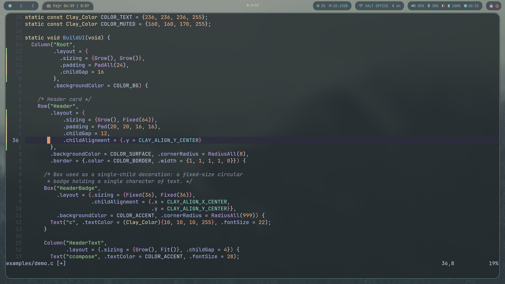

# ccompose

Small C wrapper around [Clay](https://github.com/nicbarker/clay) for building immediate-mode UI layouts, with optional raylib rendering support and Jetpack Compose like syntax.

> [!WARNING]
> **Not production ready.** ccompose is under heavy development. APIs, build layout, and behavior can change without notice. Expect breakage, missing features, and rough edges. Do not use this in anything you care about yet.



## Demo Video

https://github.com/user-attachments/assets/d81e628b-dc51-41b5-b5ed-47d669926afa


## Requirements

- CMake 3.23+
- C compiler with C11 support
- (Optional) raylib 5.5 — auto-fetched from source if not already installed

## Build

### Linux / macOS

```bash
cmake -S . -B build
cmake --build build
```

If raylib is already installed (e.g. `apt install libraylib-dev`, `brew install raylib`), CMake will find and use it. Otherwise it falls back to downloading and building raylib 5.5 from source as part of the build.

When fetching raylib from source on Linux, install the X11/GL dev headers first:

```bash
# Debian/Ubuntu
sudo apt install libgl1-mesa-dev libx11-dev libxrandr-dev libxinerama-dev libxcursor-dev libxi-dev

# Fedora
sudo dnf install mesa-libGL-devel libX11-devel libXrandr-devel libXinerama-devel libXcursor-devel libXi-devel
```

### Windows

The simplest path is raylib via [vcpkg](https://vcpkg.io):

```bash
vcpkg install raylib:x64-windows

cmake -S . -B build ^
  -DCMAKE_TOOLCHAIN_FILE=%VCPKG_ROOT%/scripts/buildsystems/vcpkg.cmake ^
  -DVCPKG_TARGET_TRIPLET=x64-windows
cmake --build build --config Debug
```

If you skip the vcpkg step, CMake will fall back to downloading raylib 5.5 from source automatically — no extra system packages needed on Windows (MSVC alone is enough).

You can override the fetched raylib version with `-DCCOMPOSE_RAYLIB_VERSION=5.0` if needed.

## Test

```bash
ctest --test-dir build --output-on-failure
```

## Run Demo

```bash
# Linux / macOS
./build/examples/ccompose_demo

# Windows
./build/examples/Debug/ccompose_demo.exe
```

## Headless Build (No raylib)

Skips the raylib backend and the demo target — useful for CI or environments without a display:

```bash
cmake -S . -B build -DCCOMPOSE_BACKEND_RAYLIB=OFF
cmake --build build
```
